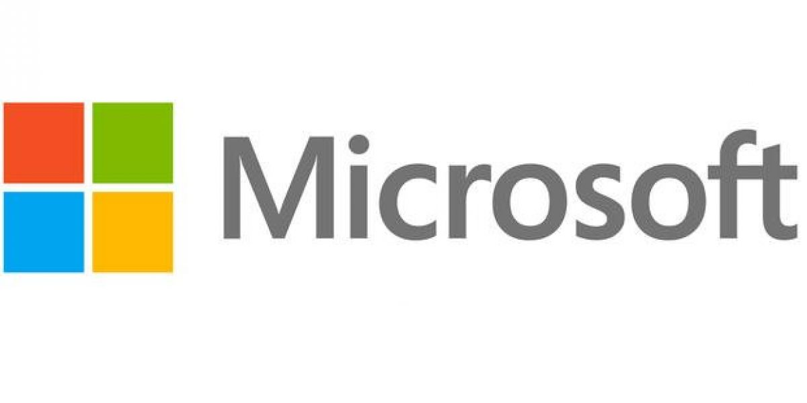
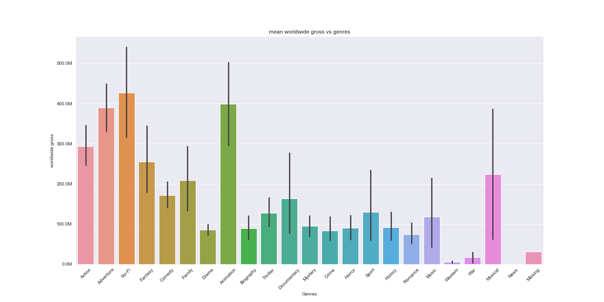
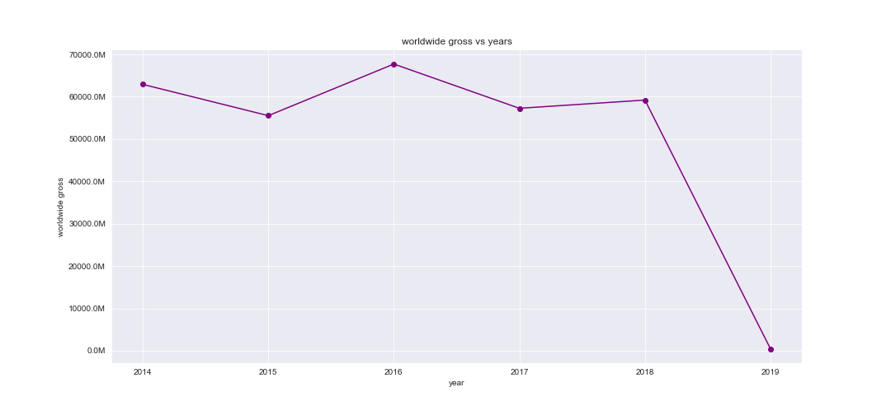

## Final Project Submission

## Microsoft enters the movie market

## Author: Vinayak Modgil

## Overview
This is a project that uses Exploratory Data Analysis to help help Microsoft make decisions based on what movies to produce on their brand new venture Microsoft Movie Studio.

## Business Problem
Venturing into the movie market, Microsoft has a choice of making original video content just like Netflix and Hulu does. As a beginner in this industry, Microsoft needs to find out the recent trends in the movie industry, and the popularity of movies as seen on IMDB, Rotten Tomotoes and TMDB. The solution is to analyse the data and help the head of Microsoft’s new movie studio to make business decisions.

## Data
The data is selected from IMDB, TMDB, TN and Rotten tomatoes. The dataset contains over 650 movies and the data ranges from genres to worldwide gross.

## Methods
This project uses descriptive analysis, including description of trends over time. This provides a useful overview of movies from 2014 to 2019.

## Results
The most popular genres are Sci-Fi follwed by Animation and Adventure.

The trend of worldwide profit over the past 5 years:

    
Types of movies that have higher popularity:

domestic gross vs worldwide gross

Trends of different budgeted films over the past 5 years:

ROI vs worldwide gross of different rated films:

## Conclusions 
#### This analysis leads to three recommendations for producing original video content:
1.) Microsoft needs to invest in media companies that make content in Sci-Fi, Animation and Adventure.
2.) As seen from the trends, usually long movies are more popular and therefore Microsoft should focus on the same.
3.) As we can see that domestic gross as well as worldwide gross have a linear relationship, Microsoft will benefit the most from releasing movies both domestically and internationally.

## Next Steps:
The following steps that can be taken by Microsoft are:
1.) Improve production speed by investing more money.
2.) Take control of budget spending on popular movies.
3.) Improve worldwide gross profit by taking charge of advertisements.

## For more Information

See the full analysis in <a href="https://github.com/vinayakmodgil/dsc-phase-1-project/blob/master/student.ipynb>Jupyter Notebook</a>  or review this <a href="https://github.com/vinayakmodgil/dsc-phase-1-project/blob/master/presentation.pdf">presentation</a>.

For additional info, contact Vinayak Modgil at vinayak.modgil@gmail.com

## Repository Structure
├── data
├── images
├── README.md
├── presentation.pdf
└── student.ipynb
